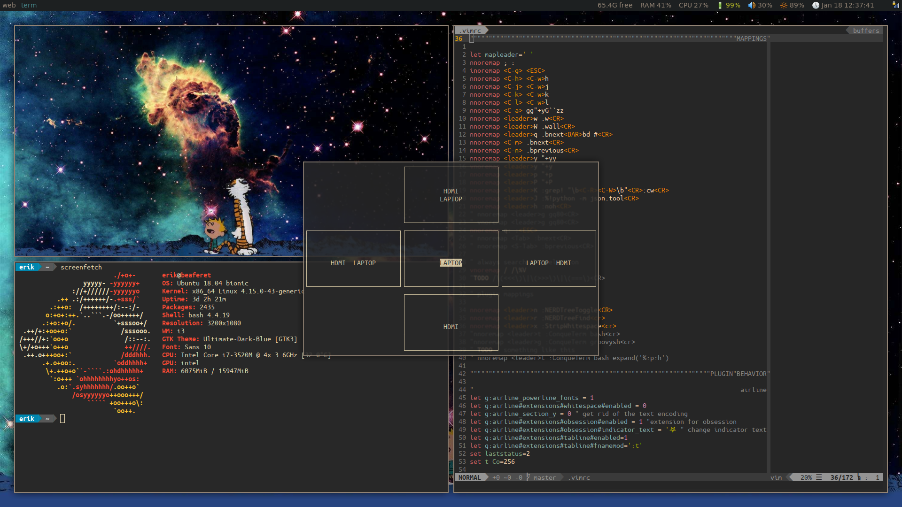

# Xrandr-ncurses
Easily manage your screens with i3



## dependencies
* ncurses
* feh

## functionality
* choose the screens that you want to use
* reloads the background

## installation
* `make build` (optional)
* Add in your I3 config
```
  bindsym $mod+shift+m exec \
    gnome-terminal --geometry=78x24 --class=window_licker -x sh -c\
    'exec /<path_to_repo>/xrandr-ncurses/xrandr-ncurses-app'
```

## TODO
Increase extensibility so that anyone can use this with just a bit of configuration.
